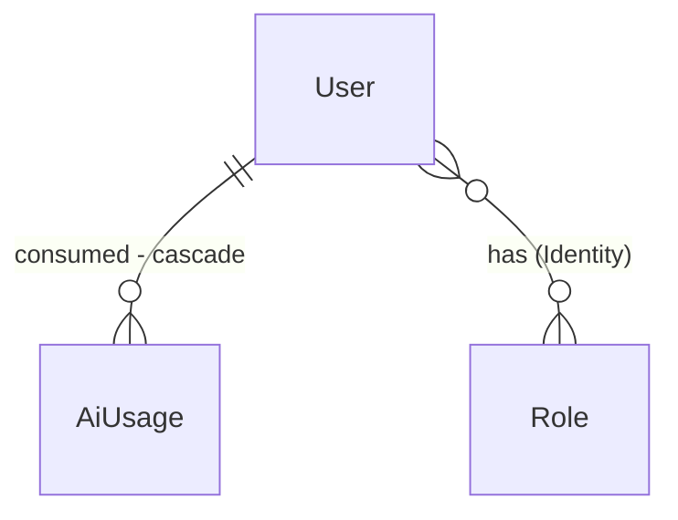

# Uso e custo de IA por usuário, visto por um admin

## Problem

Cada pergunta, upload, escolha automática e sessão de estudo chama um provedor de IA pago (OpenAI e
OpenRouter), mas o produto não registra nada disso. Ninguém sabe quanto cada usuário consome, quanto
isso custa, nem qual jeito de usar o produto (pergunta direta, escolha automática, Study Mode, upload,
resposta de lacuna) concentra o consumo. Sem esse número, a etapa 4 do PRD (planos e quotas) não tem
base: o PRD já lista "Custo da OpenAI sem controle por usuário" como risco.

Também não existe o conceito de admin: todas as contas são iguais.

A fonte não traz números. A evidência é o pedido do usuário em 2026-09-24.

Depois desta mudança, toda chamada de IA grava os tokens gastos, quem gastou e em qual modo. Um
usuário com o papel Admin abre "Uso e custo" e vê, num período, o consumo e o custo estimado por
usuário e qual modo é o mais usado.

## Flow

Reusa os pontos onde o produto já chama a IA (`AskPipeline`, `RouteAsk`, `DocumentIngestion`, a
criação de sessão do Study Mode) e o `AiProviderCall`; reusa o ASP.NET Identity para o papel (AD-009).

1. Cada chamada de IA bem-sucedida -> `IUsageRecorder` (door 2) com o modo da rota, a operação, o modelo e os tokens do `UsageDetails` que o provedor devolve
2. `IUsageRecorder` calcula o custo pela tabela `AI:Pricing` e grava um `AiUsage` (door 1) num escopo próprio, sem entrar na transação da requisição; falha ao gravar só loga
3. Startup -> garante o papel `Admin` e o dá às contas de `Admin:Emails` e, em Development, à conta de desenvolvimento (door 3)
4. `GET /api/auth/me` (exists, feature user-name) ganha `isAdmin` (door 4) -> a web sabe se mostra o link "Uso e custo"
5. `GET /api/admin/usage?from=&to=` (door 4) -> `Features/Admin/GetUsage` (new, no door - placement) agrega por usuário e por modo -> tela `/admin/usage` (new)

## Impact

| Front | What changes |
| --- | --- |
| domain | termo novo: `AiUsage` - uma chamada de IA: quem, quando, em qual modo, qual operação, qual modelo, tokens de entrada e saída, custo estimado em US$ |
| domain | termo novo: modo de uso - `ask` (pergunta direta), `routing` (escolha automática, na organização ou em todas), `study` (Study Mode), `upload` (upload de documento), `gap` (resposta de lacuna). Uma ação do usuário pode fazer várias chamadas (ex.: escolha automática = escolha + embedding da pergunta + resposta); todas levam o modo da rota |
| domain | termo novo: papel `Admin` (Identity). Até aqui ninguém tinha papel |
| código | `AskPipeline.AnswerAsync`, `RouteAsk`, `DocumentIngestion.PrepareAsync`, `OpenRouterRoutingChoice` (passa a ler `usage` da resposta) e a criação de sessão do Study Mode passam a registrar uso. Dependência: o Study Mode (branch `study-mode`) entra no `main` antes deste build |
| auth | `AddIdentityApiEndpoints<AppUser>().AddRoles<IdentityRole>()`: o cookie passa a carregar os papéis. Quem ganha o papel precisa entrar de novo para vê-lo |
| config | `AI:Pricing:<modelo>:InputPerMillion` / `OutputPerMillion` (US$ por milhão de tokens) e `Admin:Emails` (lista) |
| privacidade | o admin vê e-mail e números agregados de cada usuário, nunca pergunta, resposta ou documento |
| stored data | tabela nova; o histórico começa no deploy, sem backfill (confirmado pelo usuário: contar daqui para frente) |

## Relations

Restrições de mão única: `AiUsage` grava o custo calculado no momento da chamada (mudar a tabela de
preços não reescreve o passado); modo e operação são textos de um conjunto fechado (door 1).

## Surface

Todo erro é problem details (AD-007).

| Route | In | Out | Status |
| --- | --- | --- | --- |
| `GET /api/auth/me` (muda: campo novo) | - | `email` · `fullName` · `isAdmin` | `200`, `401` |
| `GET /api/admin/usage` | query `from`, `to` (datas; padrão: últimos 30 dias) | `from` · `to` · `since` (primeiro registro, ou nulo) · `totals{calls, actions, inputTokens, outputTokens, costUsd, unpricedCalls}` · `byUser[{userId, email, calls, actions, inputTokens, outputTokens, costUsd}]` · `byMode[{mode, calls, actions, inputTokens, outputTokens, costUsd}]` | `200`, `400`, `401`, `403` |

## Landing

| One-way door | Literal shape | Alternative rejected |
| --- | --- | --- |
| 1. Tabela de uso | `ai_usage (id, user_id FK AspNetUsers cascade, occurred_at, correlation_id varchar(64), mode varchar(16) check in ('ask','routing','study','upload','gap'), operation varchar(16) check in ('chat','embedding','choice'), model varchar(100), input_tokens int, output_tokens int, cost_usd numeric(12,6) null)`, índices `(occurred_at)` e `(user_id, occurred_at)`. `cost_usd` nulo quando o modelo não está na tabela de preços. `correlation_id` = o id de correlação da requisição: um middleware lê `X-Correlation-ID` do request (ou gera um GUID quando não vem), guarda para a requisição e devolve no header da resposta; conta ações (chamadas da mesma requisição) | Guardar só tokens e calcular o custo na leitura: uma mudança de preço reescreveria o custo histórico. Uma tabela de agregados por dia: perde o detalhe por operação e exige job de consolidação |
| 2. Registro explícito nos pontos de chamada | `IUsageRecorder.RecordAsync(UsageMode mode, UsageOperation operation, string model, UsageDetails? usage, CancellationToken)`, scoped, chamado logo depois de cada chamada de IA bem-sucedida; grava com um `AppDbContext` de um escopo novo (fora da transação do request); exceção ao gravar vira log de aviso e não falha a requisição | Decorator de `IChatClient`/`IEmbeddingGenerator` (`DelegatingChatClient`): os testes trocam os clientes por fakes depois do registro, e o decorator sumiria justamente nos testes; o modo teria que vir de estado ambiente da requisição |
| 3. Papel Admin | papel Identity `"Admin"` (`IdentityRole`), criado no startup se não existir; `Admin:Emails` (configuração) recebe o papel no startup; em Development, a conta `DevSeed:AdminEmail` também. Rotas de admin usam `RequireAuthorization(policy => policy.RequireRole("Admin"))` | Lista de e-mails checada a cada requisição, sem papel no banco: vira um segundo mecanismo quando os papéis da etapa 5 chegarem |
| 4. Rotas | `isAdmin` aditivo em `GET /api/auth/me` (criada pela feature user-name); `GET /api/admin/usage` num grupo novo `/api/admin` com a política de papel; não-admin logado recebe `403` | Uma rota `GET /api/me` separada: duplicaria a `/api/auth/me` que já existe. `isAdmin` em `GET /api/auth/manage/info`: é rota do Identity (`MapIdentityApi`), sem ponto de extensão para campos novos |

- Nada mais nesta mudança é difícil de reverter: layout da tela, períodos oferecidos e textos são código trocável.

## Criteria

### S1: Registrar o uso de IA (P1)

Toda chamada de IA deixa um registro com tokens, modo e custo.

**Acceptance Criteria**

1. WHEN `POST /api/assistants/{id}/ask` responde `200` THEN the system SHALL gravar 2 registros com modo `ask` para o usuário: `embedding` (a pergunta) e `chat`, com o modelo e os tokens de entrada e saída que o provedor informou
2. WHEN uma rota de escolha automática responde `answered` THEN the system SHALL gravar com modo `routing` a chamada `choice` e as chamadas `embedding` e `chat` da resposta, todas com o mesmo `correlation_id`
3. WHEN um upload responde `201` THEN the system SHALL gravar com modo `upload` uma chamada `embedding` por lote de embeddings
4. WHEN uma lacuna é respondida (`200`) THEN the system SHALL gravar com modo `gap` a chamada `embedding`
5. WHEN uma sessão de estudo é criada (`201`) THEN the system SHALL gravar com modo `study` a chamada `chat`
6. The system SHALL gravar `cost_usd` = tokens de entrada × preço de entrada + tokens de saída × preço de saída, com os preços por milhão de `AI:Pricing:<modelo>`, e `cost_usd` nulo quando o modelo não tem preço configurado
7. IF a chamada de IA falha THEN the system SHALL não gravar registro para ela
8. IF gravar o registro falha THEN the system SHALL responder a requisição normalmente e só registrar um aviso no log
9. The system SHALL nunca gravar em `ai_usage` nem logar o texto da pergunta, da resposta, do documento ou do prompt

**Independent test:** fazer uma pergunta e ver 2 linhas novas em `ai_usage` com modo `ask`.

### S2: Papel Admin (P1)

Só quem tem o papel vê o uso de todos.

**Acceptance Criteria**

10. WHEN a aplicação sobe THEN the system SHALL garantir que o papel `Admin` existe e que toda conta de `Admin:Emails` o tem; em Development, a conta de `DevSeed:AdminEmail` também
11. WHEN `GET /api/auth/me` é chamado com sessão THEN the system SHALL responder `200` com os campos que já tinha e `isAdmin` (`true` só para quem tem o papel)
12. IF um usuário logado sem o papel chama `GET /api/admin/usage` THEN the system SHALL responder `403` problem details
13. IF qualquer rota nova é chamada sem sessão THEN the system SHALL responder `401`

**Independent test:** entrar com a conta de desenvolvimento e ver `isAdmin = true`; entrar com outra conta e receber `403` em `/api/admin/usage`.

### S3: Relatório de uso (P1)

Consumo e custo por usuário, e o modo mais usado, num período.

**Acceptance Criteria**

14. WHEN um admin chama `GET /api/admin/usage` com `from` e `to` THEN the system SHALL responder `200` com os totais do período (`calls`, `actions` = `correlation_id` distintos, tokens de entrada e saída, custo somado) só com registros de `from` 00:00 até `to` 23:59:59 (UTC)
15. The system SHALL devolver `byUser` com todo usuário que teve uso no período (e-mail, chamadas, ações, tokens, custo), ordenado por custo decrescente e, sem custo, por tokens
16. The system SHALL devolver `byMode` com os 5 modos (inclusive os sem uso, com zeros), ordenado por ações decrescentes
17. WHEN `from` e `to` não vêm THEN the system SHALL usar os últimos 30 dias até hoje; e `since` SHALL ser a data do primeiro registro de uso existente, ou nulo
18. IF `from` é depois de `to`, alguma data é inválida, ou o período passa de 366 dias THEN the system SHALL responder `400` com `errors.from` ou `errors.to`
19. The system SHALL somar como custo só os registros com preço; o total SHALL indicar quantas chamadas ficaram sem preço (`totals.unpricedCalls`)

**Independent test:** com dois usuários usando o produto, o admin vê os dois na tabela com os números certos e o modo mais usado no topo.

### S4: Tela "Uso e custo" (P2)

**Acceptance Criteria**

20. WHILE o usuário é admin the barra lateral SHALL mostrar "Uso e custo" (link para `/admin/usage`); para os demais, o link não aparece
21. WHEN um admin abre `/admin/usage` THEN the tela SHALL mostrar o período (7, 30 ou 90 dias; padrão 30), os totais (chamadas, ações, tokens, custo em US$ com 2 casas), a tabela por usuário e o uso por modo com o mais usado destacado
22. WHEN o período muda THEN the tela SHALL pedir o relatório do novo período
23. WHEN não há uso no período THEN the tela SHALL mostrar "Nenhum uso de IA neste período"
24. WHILE o relatório carrega the tela SHALL mostrar "Carregando uso…"; IF falha THEN SHALL mostrar o `title` do problem details
25. IF um não-admin abre `/admin/usage` THEN the tela SHALL mostrar "Esta página é só para administradores"
26. WHEN há chamadas sem preço THEN the tela SHALL avisar "N chamadas sem preço configurado não entram no custo"

**Independent test:** entrar como admin, abrir "Uso e custo" e trocar o período para 7 dias.

## Out of scope

| Excluded | Why |
| --- | --- |
| Quotas e bloqueio por consumo | etapa 4; este relatório é a base dela |
| Exportar CSV | não pedido |
| Gerenciar papéis pela tela | papéis vêm da configuração; a gestão é da etapa 5 |
| Custo real cobrado pelo provedor | escolha do usuário: estimativa por tabela de preços |
| Uso por organização | o pedido é por usuário e por modo |

## Assumptions

| Assumption | Chosen default | Rationale | Confirmed? |
| --- | --- | --- | --- |
| Moeda | US$, como os provedores cobram | sem conversão de câmbio para manter | n |
| Período máximo | 366 dias | consulta agregada simples, sem pré-cálculo | n |
| Fuso das datas | UTC | o servidor grava em UTC; o relatório é por dia inteiro | n |
| "Modo mais usado" | por ações (um `correlation_id` por requisição), não por chamadas de IA | uma pergunta com escolha automática faz 3 chamadas; contar chamadas inflaria esse modo | y |
| Retenção de `ai_usage` | sem expurgo | volume pequeno nesta etapa | n |

**Open questions:**

| # | Kind | Question | Until answered |
| --- | --- | --- | --- |
| 1 | blocks go-live | Preços de `gpt-4.1-mini`, `text-embedding-3-small` e `jev-latest` em `AI:Pricing` | as chamadas aparecem como "sem preço" e o custo fica zerado |
| 2 | blocks go-live | Quem entra em `Admin:Emails` em produção | ninguém vê o relatório fora de Development |

## Observable

| Surface | Decision | Landing |
| --- | --- | --- |
| screen `Uso e custo` | empty | AC 23 |
| screen `Uso e custo` | loading, error | AC 24 |
| screen `Uso e custo` | unauthorised | AC 25 |
| screen `Uso e custo` | ordering | AC 15, 16 |
| screen `Uso e custo` | destructive action | n/a - só leitura |
| barra lateral | link por papel | AC 20 |
| API `GET /api/admin/usage` | error shape and codes | AC 12, 13, 18 |
| API `GET /api/admin/usage` | rate limit | n/a - só admins, consulta agregada |
| API `GET /api/auth/me` | error shape and codes | existing (user-name) e AC 11 |
| all new routes | versioning | n/a - único consumidor é a SPA |

## Sources

- Conversa de 2026-09-24: "um usuário admin tem que ter acesso ao custo/consumo de tokens de cada usuário do sistema e qual modo de uso está sendo mais usado"; respostas: papel Admin do Identity; tokens + tabela de preços; um id de correlação por requisição; contar daqui para frente
- [docs/PRD.md](../../../docs/PRD.md) - etapa 4 (quotas) e o risco "custo sem controle por usuário"
