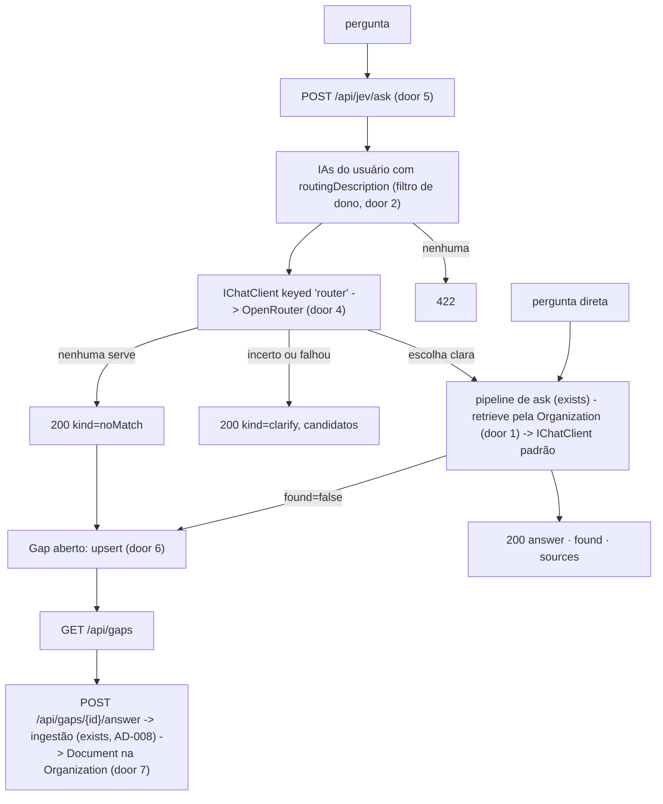
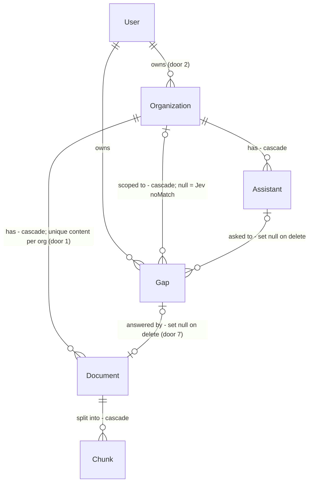

# Organizações, Jev e Lacunas

## Problem

Uma empresa que quer mais de um jeito de responder sobre o mesmo material (uma IA que só dá a
informação, outra que explica como professor) hoje precisa criar uma IA por jeito e subir os mesmos
arquivos em cada uma, porque o documento pertence a uma única IA. Cada cópia paga embeddings de
novo, e atualizar um manual significa atualizar N cópias.

Com várias IAs, quem pergunta precisa saber qual delas escolher. Escolher errado dá uma resposta
no tom errado ou uma resposta "não encontrei" de uma IA que não tem aquele assunto.

Quando uma IA não encontra a resposta nos documentos, a pergunta se perde: o dono não fica sabendo
o que falta no material, e a mesma pergunta continua sem resposta para sempre. Na etapa 1 quem
pergunta é o próprio dono. O custo cresce quando a IA for publicada (etapa 3) e quem perguntar
forem outras pessoas.

A fonte não traz números (volume de perguntas sem resposta, quantas IAs por usuário). Não existe
urgência medida.

Depois desta mudança:
- O usuário cria uma **Organização**, sobe os documentos uma vez e cria nela várias IAs com
  personalidades diferentes, que respondem do mesmo material.
- Pergunta ao **Jev**, que escolhe a IA certa, mostra quem respondeu e deixa trocar.
- Encontra em **Lacunas** as perguntas que nenhuma IA soube responder, responde em texto e essa
  resposta passa a ser conhecimento da organização.

## Flow

Reusa o pipeline de ask do rag-mvp (retrieve top-5 -> chat) como está. O Jev só escolhe o
`Assistant` e chama o mesmo caminho. A resposta a uma lacuna reusa a ingestão do upload
(chunk -> embed -> 1 transação, AD-008) em vez de um armazenamento de FAQ à parte.

1. `POST /api/organizations` cria a `Organization` do usuário (door 1). Documentos são enviados a `POST /api/organizations/{id}/documents`, a ingestão existente (`UploadDocument`, que muda de rota) grava `Document` + `Chunk`s na organização.
2. `POST /api/assistants` cria a IA dentro de uma organização, com `routingDescription` opcional (door 3).
3. Ask direto (`AskAssistant`, exists): resolve o `Assistant` pelo filtro de dono (door 2), recupera chunks de **todos** os documentos da organização dele, e o chat devolve `{answer, found}` estruturado (door 6). `found=false` registra ou incrementa um `Gap` aberto.
4. Jev (`Features/Jev`, door 5): carrega as IAs elegíveis, pede ao `IChatClient` keyed `router` (OpenRouter, door 4) um índice e uma confiança. Com escolha clara, chama o passo 3 para a IA escolhida. Com baixa confiança ou falha do roteador, devolve candidatos. Com "nenhuma", registra um `Gap` sem organização.
5. Lacunas (`Features/Gaps`, new): lista as abertas. Responder cria um `Document` de texto na organização via a ingestão existente e fecha a lacuna na mesma transação. Dispensar só fecha.

## Impact

| Front | What changes |
| --- | --- |
| domain | termo novo: `Organization` - contêiner do usuário que guarda documentos e IAs. Na etapa 1 tem um dono e nenhum membro. É **a mesma** entidade que a etapa 5 vai estender com membros e papéis, não uma segunda |
| domain | termo existente: `Assistant` era "IA + os documentos dela". Passa a ser "persona (nome, instruções, quando usar) dentro de uma organização", sem documentos próprios. Quem depende disso hoje: `UploadDocument`, `ListDocuments`, `DeleteDocument`, `AskAssistant.RetrieveAsync`, `GetAssistant`/`ListAssistants` (`documentCount`), `AssistantPage.tsx`, e os testes `DocumentsTests`/`AskTests` |
| domain | termo existente: isolamento. "Documento de uma IA não aparece em outra" (PRD §4.3) passa a valer **entre organizações**: IAs da mesma organização compartilham documentos de propósito |
| domain | termo novo: `Jev` - o roteador por usuário. Não é entidade: é uma rota e um prompt |
| domain | termo novo: `Gap` (UI: "Lacuna") - pergunta que ficou sem resposta, com contador e estado `open`/`answered`/`dismissed` |
| stored data | migração com backfill: para cada `Assistant` existente cria uma `Organization` com o mesmo nome e dono, move os `Document`s dele para ela e remove `assistants.owner_id`. Uma organização por IA preserva o isolamento que existia, e o índice único novo `(organization_id, content_sha256)` não colide porque cada organização herda os documentos de uma IA só |
| contrato | rotas `/api/assistants/{id}/documents*` **saem**. Único consumidor: a SPA deste repo. Os testes do rag-mvp que as usam são reescritos para as rotas novas (o contrato mudou por decisão deste plano, as asserções não enfraquecem) |
| contrato | `POST /api/assistants/{id}/ask` ganha o campo `found` (aditivo). `POST /api/assistants` passa a exigir `organizationId` |
| terceiro | a pergunta do usuário, os nomes e as descrições das IAs passam a ir para a OpenRouter, além da OpenAI. Conteúdo de documento **não** vai (critério 27) |
| decisões | AD-006 é substituída (a raiz do filtro de dono vira `Organization`). AD-004 ganha um segundo `IChatClient` keyed. Atualizar a regra de isolamento em `AGENTS.md` e `.claude/agents/architecture-guardian.md` |
| produto | o PRD põe organizações na etapa 5. A etapa 5 fica só com membros, papéis e convites |

## Relations

Restrições de mão única:
- `Document` é único por (`Organization`, SHA-256) (door 1).
- `Assistant` pertence a exatamente uma `Organization`, não nula e sem troca nesta etapa (door 1).
- Existe no máximo um `Gap` **aberto** por (dono, organização, pergunta normalizada), com organização nula contando como valor (door 6).
- Apagar a `Organization` apaga IAs, documentos, chunks e lacunas dela.
- Apagar um `Assistant` mantém as lacunas dele, sem a IA.

## Surface

Todo erro é problem details (AD-007). Toda rota exige o cookie de sessão (`401` sem ele). Rotas de
recurso de outro usuário respondem `404`.

| Route | In | Out | Status |
| --- | --- | --- | --- |
| `POST /api/organizations` | `name` | `id` · `name` · `createdAt` | `201`, `400`, `401` |
| `GET /api/organizations` | - | `[{id, name, createdAt, assistantCount, documentCount}]` | `200`, `401` |
| `GET /api/organizations/{id}` | - | `id` · `name` · `createdAt` · `assistants[{id, name, routingDescription}]` · `documentCount` | `200`, `401`, `404` |
| `DELETE /api/organizations/{id}` | - | vazio | `204`, `401`, `404` |
| `POST /api/organizations/{id}/documents` | multipart `file` | `id` · `fileName` · `sizeBytes` · `chunkCount` · `uploadedAt` | `201`, `400`, `401`, `404`, `409`, `413`, `415`, `422`, `502` |
| `GET /api/organizations/{id}/documents` | - | `[{id, fileName, sizeBytes, chunkCount, uploadedAt}]` | `200`, `401`, `404` |
| `DELETE /api/organizations/{id}/documents/{documentId}` | - | vazio | `204`, `401`, `404` |
| `POST /api/assistants` (muda) | `organizationId`, `name`, `instructions?`, `routingDescription?` | `id` · `organizationId` · `name` · `instructions` · `routingDescription` · `createdAt` | `201`, `400`, `401`, `404` |
| `GET /api/assistants/{id}` (muda) | - | `id` · `organizationId` · `organizationName` · `name` · `instructions` · `routingDescription` · `createdAt` | `200`, `401`, `404` |
| `POST /api/assistants/{id}/ask` (muda) | `question` | `answer` · `found` · `sources[{documentId, fileName, chunkIndex, excerpt}]` | `200`, `400`, `401`, `404`, `429`, `502` |
| `POST /api/jev/ask` | `question` | `kind` = `answered`: `assistant{id, name, organizationName}` · `answer` · `found` · `sources[]` · `alternatives[{id, name, organizationName}]`; `kind` = `clarify`: `candidates[{id, name, organizationName}]`; `kind` = `noMatch`: nada mais | `200`, `400`, `401`, `422`, `429`, `502` |
| `GET /api/gaps` | - | `[{id, question, askCount, firstAskedAt, lastAskedAt, organization{id, name}?, assistant{id, name}?}]` | `200`, `401` |
| `POST /api/gaps/{id}/answer` | `answer`, `organizationId?` | `id` · `status` · `documentId` | `200`, `400`, `401`, `404`, `409`, `502` |
| `POST /api/gaps/{id}/dismiss` | - | vazio | `204`, `401`, `404`, `409` |

Saem: `POST|GET /api/assistants/{id}/documents`, `DELETE /api/assistants/{id}/documents/{documentId}`
(passam a cair no `404` de rota desconhecida). `GET /api/assistants` (lista) sai: a lista de IAs vem
de `GET /api/organizations/{id}`.

## Landing

| One-way door | Literal shape | Alternative rejected |
| --- | --- | --- |
| 1. Organização como dona dos documentos | tabela `organizations (id, owner_id, name, created_at)`. `assistants.organization_id` e `documents.organization_id` NOT NULL com FK `ON DELETE CASCADE`. `documents.assistant_id` removida. Índice único `(organization_id, content_sha256)` substitui `(assistant_id, content_sha256)`. Retrieve: `c.Document.OrganizationId == assistant.OrganizationId`. Migração: uma organização por IA existente, com o mesmo nome | `KnowledgeBase` separada que IAs referenciam: dois contêineres (base e organização) para o mesmo papel, e a etapa 5 ainda precisaria de organização por cima. Organização única padrão por usuário ("Pessoal") na migração: juntaria documentos de IAs que hoje são isoladas e mudaria respostas existentes |
| 2. Raiz do isolamento (substitui AD-006) | `HasQueryFilter(o => o.OwnerId == CurrentUserId)` em `Organization`. `Assistant`: `a.Organization.OwnerId == CurrentUserId`. `Document`: `d.Organization.OwnerId == ...`. `Chunk`: `c.Document.Organization.OwnerId == ...`. `Gap`: `g.OwnerId == ...` (tem dono próprio porque a organização pode ser nula). `assistants.owner_id` sai | Manter `owner_id` também em `Assistant`: duas fontes de posse que podem divergir. Filtro por membros agora: não existem membros na etapa 1 |
| 3. `routingDescription` | coluna `assistants.routing_description varchar(500)` nula. Nula ou vazia = IA fora do Jev. Nome no payload: `routingDescription`. UI: "Quando usar esta IA" | Reusar `instructions` para rotear: mistura prompt de comportamento com descrição para escolha, e manda instruções inteiras para um terceiro. Flag `includeInJev` separada: dois campos para uma decisão só |
| 4. Segundo provedor de chat (estende AD-004) | `services.AddKeyedChatClient("router", …)` sobre `OpenAIClient` com `Endpoint = https://openrouter.ai/api/v1`; config `AI:OpenRouter:ApiKey` e `AI:OpenRouter:Model` (user-secrets). Handler: `[FromKeyedServices("router")] IChatClient`. Sem chave: `UnconfiguredAiClient`, e o Jev cai no `clarify` (critério 23). Testes: `FakeChatClient` keyed separado | SDK/HTTP da OpenRouter direto no handler: viola AD-004 e não dá para simular. Usar a OpenRouter também para as respostas: escolha do usuário foi só para o Jev |
| 5. Contrato do Jev | `POST /api/jev/ask` com um único formato de resposta discriminado por `kind` ∈ {`answered`, `clarify`, `noMatch`}. O roteador recebe IAs **por índice** (`1..N`) e devolve `{"choice": <int or null>, "confident": <bool>}`. O servidor valida o intervalo, e id vindo do modelo nunca é usado | Três status HTTP diferentes para os três desfechos: `clarify` e `noMatch` não são erro. Modelo devolvendo o GUID: GUID alucinado ou de outro usuário teria que ser revalidado, e o índice elimina a classe de erro |
| 6. Sinal de "não encontrei" e unicidade da lacuna | o chat do ask devolve JSON `{"answer": string, "found": bool}`. `found=false` faz upsert em `gaps` com `ON CONFLICT (owner_id, organization_id, normalized_question) WHERE status = 'open'` sobre índice único parcial `NULLS NOT DISTINCT`, somando 1 em `ask_count`. `normalized_question` = trim, minúsculas, espaços colapsados. `status` ∈ {`open`, `answered`, `dismissed`}. Só `open` transiciona | Limiar de distância do vetor para decidir "não encontrei": depende de modelo e de corpus, e não enxerga uma resposta que o trecho não contém. Contar via SELECT-then-INSERT: duas perguntas iguais simultâneas criariam duas lacunas |
| 7. Resposta de lacuna vira `Document` | a resposta é ingerida pela ingestão existente como `Document` de texto na organização, `file_name` = `Lacuna - <primeiros 60 caracteres da pergunta>.md`, conteúdo `# Pergunta\n<pergunta>\n\n# Resposta\n<resposta>`. `gaps.document_id` FK `ON DELETE SET NULL`. Lacuna fechada na mesma transação do documento | Tabela de FAQ com embedding próprio: segundo caminho de retrieve e de citação. Gravar a resposta no prompt da IA: não escala e não aparece como fonte |

- Nada mais nesta mudança é difícil de reverter: prompts do roteador e do ask, limite de candidatos, ordenação da lista de lacunas, textos e telas são código trocável.

## Criteria

### S1: Organização com documentos compartilhados entre IAs (P1)

Subir um documento uma vez e ter várias IAs da mesma organização respondendo com ele.

**Acceptance Criteria**

1. WHEN `POST /api/organizations` recebe `name` com 1 a 100 caracteres após trim THEN the system SHALL responder `201` com `id`, `name` e `createdAt`
2. IF `POST /api/organizations` recebe `name` vazio ou com mais de 100 caracteres THEN the system SHALL responder `400` com `errors.name`
3. WHEN `GET /api/organizations` é chamado THEN the system SHALL responder `200` só com as organizações do usuário, ordenadas por `createdAt` decrescente, cada uma com `assistantCount` e `documentCount` corretos
4. IF qualquer rota `/api/organizations/{id}*` recebe o id de uma organização de outro usuário ou inexistente THEN the system SHALL responder `404` com problem details
5. WHEN `POST /api/assistants` recebe `organizationId` de uma organização do usuário, `name`, `instructions?` e `routingDescription?` THEN the system SHALL responder `201` com `id`, `organizationId`, `name`, `instructions`, `routingDescription` e `createdAt`
6. IF `POST /api/assistants` não recebe `organizationId` THEN the system SHALL responder `400` com `errors.organizationId`
7. IF `POST /api/assistants` recebe `organizationId` de outro usuário ou inexistente THEN the system SHALL responder `404` e nenhuma IA SHALL ser criada
8. IF `POST /api/assistants` recebe `routingDescription` com mais de 500 caracteres THEN the system SHALL responder `400` com `errors.routingDescription`
9. WHEN um documento é enviado uma vez a `POST /api/organizations/{id}/documents` e duas IAs dessa organização recebem uma pergunta sobre ele THEN the system SHALL citar o mesmo `documentId` nas `sources` das duas respostas
10. The system SHALL recuperar, em `POST /api/assistants/{id}/ask`, só trechos de documentos da organização daquela IA. Um documento de outra organização do mesmo usuário SHALL nunca aparecer em `sources`
11. IF o mesmo conteúdo (SHA-256) é enviado duas vezes à mesma organização THEN the system SHALL responder `409` na segunda vez. Enviado a outra organização, SHALL responder `201`
12. The system SHALL manter em `POST /api/organizations/{id}/documents` as respostas de validação do upload do rag-mvp: `400` sem arquivo, `413` acima de 10 MB, `415` para formato não suportado, `422` sem texto extraível, `502` na falha de embedding
13. WHEN `DELETE /api/organizations/{id}` é chamado THEN the system SHALL responder `204` e remover fisicamente as IAs, os documentos, os chunks e as lacunas dessa organização
14. WHEN a migração roda sobre um banco com IAs e documentos do rag-mvp THEN the system SHALL criar para cada IA uma organização com o mesmo nome e dono, mover os documentos dela para essa organização, e o ask da IA SHALL citar os mesmos `documentId` de antes
15. IF uma requisição chega a `/api/assistants/{id}/documents` ou `/api/assistants/{id}/documents/{documentId}` THEN the system SHALL responder `404` com problem details
16. WHEN a tela `Organizações` não tem nenhuma organização THEN the system SHALL mostrar o texto "Crie sua primeira organização" e o formulário de criação
17. WHEN a tela `Organização` é aberta THEN the system SHALL listar os documentos e as IAs dessa organização, com upload e criação de IA (com o campo "Quando usar esta IA")
18. WHEN o usuário apaga uma organização na tela THEN the system SHALL pedir confirmação dizendo que IAs, documentos e lacunas serão apagados, e só chamar `DELETE` depois de confirmado

**Independent test:** criar organização, subir um PDF, criar "Direto" e "Professor", perguntar às duas e ver o mesmo documento citado.

### S2: Jev escolhe a IA (P1)

Uma pergunta ao Jev chega à IA certa, e o usuário vê quem respondeu e pode trocar.

**Acceptance Criteria**

19. The system SHALL oferecer ao roteador só as IAs do usuário com `routingDescription` não vazia, de todas as organizações dele
20. WHEN o roteador escolhe uma IA elegível com `confident=true` THEN `POST /api/jev/ask` SHALL responder `200` com `kind=answered`, `assistant{id, name, organizationName}`, `answer`, `found` e `sources` produzidos pelo mesmo pipeline de `POST /api/assistants/{id}/ask`, e `alternatives` com as demais IAs elegíveis (até 3)
21. WHEN o roteador devolve `confident=false` THEN the system SHALL responder `200` com `kind=clarify` e `candidates` com até 3 IAs elegíveis, sem chamar o `IChatClient` de resposta
22. WHEN o roteador devolve `choice=null` com `confident=true` THEN the system SHALL responder `200` com `kind=noMatch` e registrar uma lacuna aberta sem organização e sem IA
23. IF a chamada ao roteador falha, ou devolve algo que não é o JSON esperado, ou um índice fora de `1..N` THEN the system SHALL responder `200` com `kind=clarify` e `candidates` = até 5 IAs elegíveis ordenadas por nome
24. IF o usuário não tem nenhuma IA elegível THEN `POST /api/jev/ask` SHALL responder `422` com problem details e não chamar o roteador
25. IF `question` está vazia ou passa de 2000 caracteres THEN `POST /api/jev/ask` SHALL responder `400` com `errors.question`
26. The system SHALL contar cada `POST /api/jev/ask` no mesmo limite de 20 perguntas por minuto por usuário do ask. A 21ª pergunta em 60 s, somando as duas rotas, SHALL receber `429`
27. The system SHALL mandar ao `IChatClient` keyed `router` só a pergunta, os nomes das IAs, os nomes das organizações e as `routingDescription`. Instruções das IAs e conteúdo de documento SHALL nunca ir para o roteador
28. WHEN a tela `Jev` recebe `kind=answered` THEN the system SHALL mostrar "Respondido por <nome> · <organização>" e um botão por alternativa. Clicar numa alternativa SHALL chamar `POST /api/assistants/{id}/ask` com a mesma pergunta e trocar a resposta e o nome mostrados
29. WHEN a tela `Jev` recebe `kind=clarify` THEN the system SHALL mostrar "Qual destas IAs deve responder?" com um botão por candidato, e clicar SHALL perguntar àquela IA
30. WHEN a tela `Jev` recebe `kind=noMatch` THEN the system SHALL mostrar "Nenhuma IA sabe responder isso ainda. A pergunta foi para Lacunas."
31. WHEN a tela `Jev` recebe `422` THEN the system SHALL mostrar "Preencha 'Quando usar esta IA' em pelo menos uma IA para usar o Jev" com link para `Organizações`
32. WHILE `POST /api/jev/ask` está em andamento the tela `Jev` SHALL mostrar "Jev está escolhendo…" e desabilitar o envio. IF a resposta é `429` ou `502` THEN SHALL mostrar o `title` do problem details

**Independent test:** com "Direto" (quando usar: "respostas curtas e objetivas") e "Professor" (quando usar: "quando a pessoa quer entender"), perguntar "me explica como funciona X" e ver "Respondido por Professor". Trocar para Direto.

### S3: Lacunas viram conhecimento (P1)

O dono vê o que ficou sem resposta, responde uma vez, e a IA passa a saber.

**Acceptance Criteria**

33. WHEN o chat de `POST /api/assistants/{id}/ask` (direto ou via Jev) devolve `found=false` THEN the system SHALL responder `200` com `found=false` e registrar uma lacuna aberta com a organização e a IA daquela pergunta e `askCount=1`
34. WHEN a mesma pergunta normalizada (trim, minúsculas, espaços colapsados) volta sem resposta enquanto existe lacuna aberta da mesma organização (ou das duas sem organização) THEN the system SHALL somar 1 em `askCount`, atualizar `lastAskedAt` e não criar outra lacuna. Duas perguntas iguais simultâneas SHALL resultar em uma lacuna com `askCount=2`
35. IF o chat do ask devolve algo que não é o JSON `{answer, found}` THEN the system SHALL responder `200` com o texto bruto em `answer` e `found=true`, sem registrar lacuna
36. WHEN `GET /api/gaps` é chamado THEN the system SHALL responder `200` só com as lacunas abertas do usuário, ordenadas por `askCount` decrescente e depois `lastAskedAt` decrescente
37. WHEN `POST /api/gaps/{id}/answer` recebe `answer` com 1 a 4000 caracteres para uma lacuna aberta THEN the system SHALL responder `200` com `status=answered` e `documentId`, e o documento SHALL aparecer em `GET /api/organizations/{orgId}/documents` com `fileName` começando por `Lacuna - `
38. WHEN uma lacuna foi respondida e a mesma pergunta é feita a uma IA daquela organização THEN the system SHALL citar o `documentId` da resposta em `sources`
39. IF a lacuna não tem organização e `organizationId` não é enviado THEN `POST /api/gaps/{id}/answer` SHALL responder `400` com `errors.organizationId`. IF `organizationId` é de outro usuário THEN SHALL responder `404`
40. IF `answer` está vazio ou passa de 4000 caracteres THEN the system SHALL responder `400` com `errors.answer`
41. IF `POST /api/gaps/{id}/answer` ou `POST /api/gaps/{id}/dismiss` recebe uma lacuna que não está aberta THEN the system SHALL responder `409`
42. IF o embedding da resposta falha THEN the system SHALL responder `502`, a lacuna SHALL continuar aberta e nenhum documento SHALL ser criado
43. WHEN `POST /api/gaps/{id}/dismiss` recebe uma lacuna aberta THEN the system SHALL responder `204` e ela SHALL sair de `GET /api/gaps`
44. IF qualquer rota `/api/gaps/{id}*` recebe a lacuna de outro usuário ou inexistente THEN the system SHALL responder `404`
45. WHEN uma IA é apagada THEN the system SHALL manter as lacunas dela, com `assistant` nulo em `GET /api/gaps`
46. The system SHALL nunca escrever em log o texto de uma pergunta, de uma resposta de lacuna ou da resposta do roteador
47. The system SHALL mostrar no menu "Lacunas (N)", com N = número de lacunas abertas, e só "Lacunas" quando N = 0
48. WHEN a tela `Lacunas` não tem lacunas abertas THEN the system SHALL mostrar "Nenhuma lacuna. Suas IAs responderam tudo o que foi perguntado."
49. WHEN o usuário responde uma lacuna sem organização na tela `Lacunas` THEN the system SHALL exigir a escolha de uma organização num seletor antes de enviar, e após `200` a lacuna SHALL sair da lista
50. WHEN o usuário dispensa uma lacuna THEN the system SHALL pedir confirmação ("A pergunta sai da lista e não volta") antes de chamar `dismiss`
51. WHILE `GET /api/gaps` está carregando the tela `Lacunas` SHALL mostrar "Carregando lacunas…". IF a lista ou uma ação falha THEN SHALL mostrar o `title` do problem details

**Independent test:** perguntar algo que não está nos documentos, ver a lacuna em `Lacunas (1)`, responder, perguntar de novo e ver a resposta citada.

## Out of scope

| Excluded | Why |
| --- | --- |
| Membros, papéis e convites em organizações | etapa 5. Aqui a organização tem só o dono |
| Vários Jevs (um por organização) e Jev publicado | escolha do usuário: um Jev por usuário. Publicar é etapa 3 |
| Renomear organização ou IA, mover IA entre organizações | não existe edição no rag-mvp. Mover muda o que a IA sabe |
| Conversa com histórico e Jev "grudado" numa IA durante a conversa | depende da etapa 2 |
| Agrupar lacunas por semelhança de sentido | v1 agrupa por texto normalizado |
| Reabrir lacuna respondida ou dispensada | estados terminais nesta etapa |
| Notificação (e-mail/WhatsApp) de lacuna nova | sem canal de envio no produto ainda |
| OpenRouter para as respostas das IAs ou para embeddings | escolha do usuário: só o roteador |
| Marcar manualmente uma resposta como ruim ("não ajudou") para virar lacuna | depende de feedback na UI; v1 usa só o `found` do modelo |

## Assumptions

| Assumption | Chosen default | Rationale | Confirmed? |
| --- | --- | --- | --- |
| Organização é o contêiner pedido | uma `Organization` de dono único agora, a mesma entidade que ganha membros na etapa 5 | o usuário pediu "uma entidade maior, como uma organização". Dono único evita puxar a etapa 5 inteira | n |
| Migração dos dados existentes | uma organização por IA existente, com o nome da IA | preserva respostas e isolamento atuais. Juntar tudo numa organização mudaria respostas | n |
| Rotas antigas de documento | removidas, sem alias | único consumidor é a SPA deste repo, e um alias por IA teria que subir documento para a organização inteira, que surpreende | n |
| Falha do roteador | degrada para `clarify` com até 5 IAs em vez de `502` | a pergunta ainda chega a uma IA com um clique. O roteador é um terceiro a mais que pode cair | n |
| Confiança do roteador | booleana (`confident`), decidida pelo próprio modelo | um limiar numérico não teria base sem dados | n |
| Tamanho de `alternatives`/`candidates` | até 3 (até 5 no fallback) | botões demais anulam o propósito do roteador | n |
| JSON inválido no ask | trata como respondido, sem lacuna | lacuna falsa polui a caixa do dono. Resposta válida perdida é mais barata | n |
| Limite de `routingDescription` | 500 caracteres | vai para o prompt do roteador N vezes | n |
| Limite da resposta de lacuna | 4000 caracteres | mesmo limite de `instructions` | n |

**Open questions:**

| # | Kind | Question | Until answered |
| --- | --- | --- | --- |
| 1 | blocks go-live | Qual modelo da OpenRouter usar no roteador (`AI:OpenRouter:Model`)? Precisa aceitar saída JSON | o Jev roda sempre no fallback `clarify` sem chave/modelo. Os testes usam fake |
| 2 | blocks go-live | Chave da OpenAI de produção (já pendente no rag-mvp) | ask e embeddings não funcionam de verdade |

## Observable

| Surface | Decision | Landing |
| --- | --- | --- |
| screen `Organizações` | empty state | AC 16 |
| screen `Organizações` | loading, error | existing - padrão de loading/erro do `AssistantsPage` (rag-mvp) |
| screen `Organizações` | unauthorised | existing - `RequireAuth` |
| screen `Organizações` | destructive action confirms | AC 18 |
| screen `Organizações` | ordering | AC 3 (createdAt desc) |
| screen `Organização` | conteúdo e ações | AC 17 |
| screen `Organização` | empty (sem documentos / sem IAs) | existing - textos vazios do `AssistantPage` para documentos. IAs: "Nenhuma IA nesta organização" junto ao AC 17 |
| screen `Organização` | apagar documento / IA confirma | existing - confirmação do rag-mvp |
| screen `Organização` | 404 (organização alheia) | existing - tratamento de 404 do `AssistantPage` |
| screen `IA` | mostra organização, sem seção de documentos | AC 17 (documentos migram para a organização) |
| screen `Jev` | answered, clarify, noMatch | AC 28, 29, 30 |
| screen `Jev` | empty (sem IA elegível) | AC 31 |
| screen `Jev` | loading, error | AC 32 |
| screen `Jev` | destructive action | n/a - a tela não apaga nada |
| screen `Lacunas` | empty, loading, error | AC 48, 51 |
| screen `Lacunas` | ordering | AC 36 |
| screen `Lacunas` | destructive action confirms | AC 50 |
| screen `Lacunas` | badge de contagem | AC 47 |
| API `POST /api/jev/ask` | response shape | AC 20-22, door 5 |
| API `POST /api/jev/ask` | error shape and codes | AC 24, 25, 26. `502` só se o **ask** falhar depois do roteamento (pipeline existente) |
| API `POST /api/jev/ask` | rate limit | AC 26 |
| API `/api/gaps*` | error shape and codes | AC 39-42, 44 |
| API `/api/organizations*` | error shape and codes | AC 2, 4, 11, 12 |
| all new `/api/*` | quem pode chamar | AC 4, 7, 44. `401` sem sessão: existing - `RequireAuthorization` do rag-mvp |
| all new `/api/*` | versioning | n/a - único consumidor é a SPA na mesma origem, publicada junto |
| all new `/api/gaps*`, `/api/organizations*` | rate limit | n/a - CRUD barato, sem chamada de IA, exceto `answer` (1 embedding por ação manual do dono) |
| collection `Lacunas` | grouping criterion, duplicates | AC 34 |
| collection `Lacunas` | exception que não cabe (sem organização) | AC 22, 39, 49 |

## Sources

- Conversa de 2026-09-24: Jev roteia entre IAs da mesma empresa com comportamentos diferentes. "Entidade maior, como uma organização". Um Jev por usuário. OpenRouter para o Jev (chave já existe)
- [docs/PRD.md](../../../docs/PRD.md) - roadmap por etapas (organizações na etapa 5, publicação na 3)
