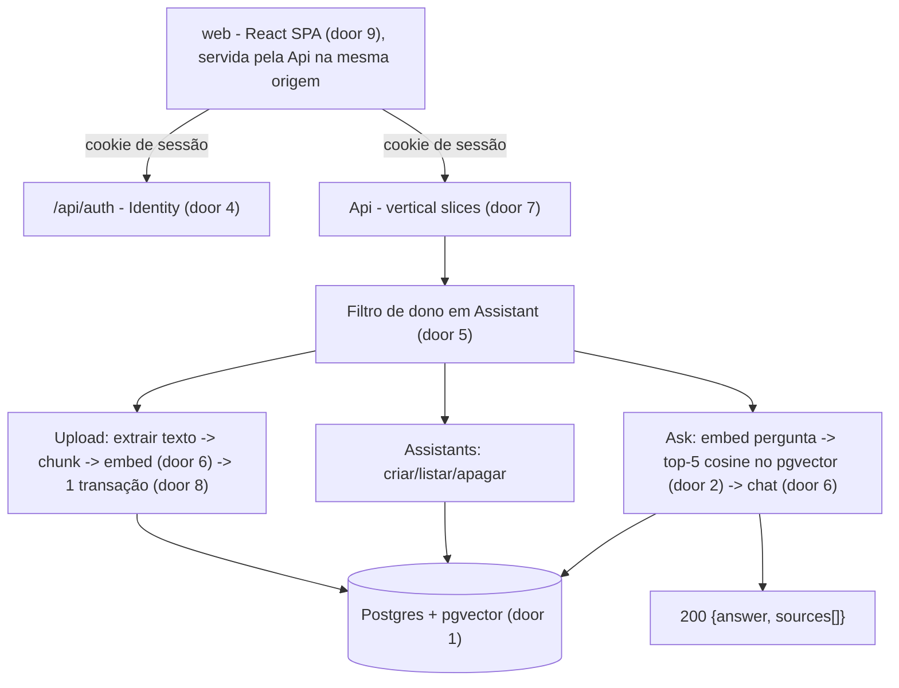
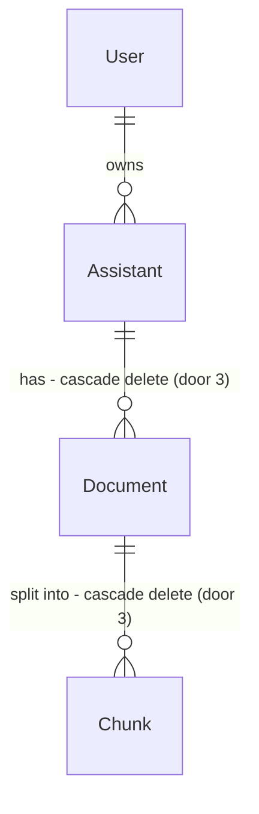

# RAG MVP - login, criar a própria IA, anexar documentos, perguntar

## Problem

Quem quer uma IA que responda com base nos próprios documentos (manuais, políticas internas,
material de estudo) hoje precisa montar sozinho a extração de texto, o chunking, os embeddings,
o banco vetorial e o prompt. Isso exige saber programar e integrar ao menos três serviços. Quem
não sabe fazer isso fica restrito a colar trechos num chat genérico, que esquece o contexto,
não cita a fonte e não isola os documentos de um assunto dos de outro.

A fonte não traz nenhum número (conversão, volume, prazo). Não existe urgência medida.

Quando isso entrar: o usuário cria uma conta, cria uma "IA" com nome e instruções próprias,
sobe PDFs/TXT/MD e faz perguntas que são respondidas **só com o conteúdo daquela IA**, com as
fontes citadas.

## Flow

Repositório vazio: nada é reutilizado do código. Reutilizamos o ASP.NET Core Identity (door 4)
em vez de sessão/token feitos à mão, e o `Microsoft.Extensions.AI` (door 6) em vez de um cliente
OpenAI próprio.

1. Usuário -> `web` (door 9) -> `POST /api/auth/login?useCookies=true` -> Identity (door 4) grava o cookie de sessão HttpOnly.
2. `web` chama `Api` na mesma origem, com o cookie. Toda rota `/api/assistants*` resolve o `Assistant` pelo filtro de dono (door 5); de outro dono ou inexistente -> 404.
3. Upload: `Api` valida extensão/tamanho, calcula SHA-256, extrai texto (PdfPig para PDF), quebra em chunks, gera embeddings em lote via `IEmbeddingGenerator` (door 6), grava `Document` + `Chunk`s numa única transação (door 8) -> 201.
4. Ask: embed da pergunta -> top-5 `Chunk` do **mesmo** `Assistant` por distância de cosseno (HNSW, door 2) -> `IChatClient` recebe instruções do assistente + trechos + pergunta -> 200 com resposta e fontes.

## Impact

| Front | What changes |
| --- | --- |
| domain | termo novo: `Assistant` - a "IA" do usuário: nome + instruções + documentos. Na UI aparece como "IA"; no código e nas rotas é sempre `Assistant` |
| domain | termo novo: `Document` - arquivo enviado a um `Assistant`, já processado (não existe estado intermediário, door 8) |
| domain | termo novo: `Chunk` - trecho de texto de um `Document` com seu embedding; unidade de recuperação e de citação |
| domain | termo novo: `Source` - um `Chunk` citado numa resposta (payload, não entidade) |
| stored data | nada a migrar - banco novo |
| repo | monorepo criado do zero: solução .NET + app Node em `src/web`, `docker-compose.yml`, `AGENTS.md`, agente `.claude/agents/architecture-guardian.md` |

## Relations

Constraints de mão única: `Document` único por (`Assistant`, hash SHA-256 do conteúdo) (door 3);
embedding de `Chunk` com dimensão fixa 1536 (door 2); apagar `Assistant` apaga `Document`s e
`Chunk`s; apagar `Document` apaga seus `Chunk`s (door 3). `User` é a tabela do Identity (door 4).

## Surface

Todas as respostas de erro são `application/problem+json` (RFC 9457, door 7). Rotas `/api/assistants*` e `/api/auth/manage/*` exigem o cookie de sessão.

| Route | In | Out | Status |
| --- | --- | --- | --- |
| `POST /api/auth/register` | `email`, `password` | vazio | `200`, `400` |
| `POST /api/auth/login?useCookies=true` | `email`, `password` | vazio + `Set-Cookie` de sessão | `200`, `401` |
| `POST /api/auth/logout` | - | vazio, cookie expirado | `204` |
| `GET /api/auth/manage/info` | - | `email` · `isEmailConfirmed` | `200`, `401` |
| `POST /api/assistants` | `name`, `instructions?` | `id` · `name` · `instructions` · `createdAt` | `201`, `400`, `401` |
| `GET /api/assistants` | - | `[{id, name, instructions, createdAt, documentCount}]` | `200`, `401` |
| `GET /api/assistants/{id}` | - | `id` · `name` · `instructions` · `createdAt` · `documentCount` | `200`, `401`, `404` |
| `DELETE /api/assistants/{id}` | - | vazio | `204`, `401`, `404` |
| `POST /api/assistants/{id}/documents` | multipart `file` | `id` · `fileName` · `sizeBytes` · `chunkCount` · `uploadedAt` | `201`, `400`, `401`, `404`, `409`, `413`, `415`, `422`, `502` |
| `GET /api/assistants/{id}/documents` | - | `[{id, fileName, sizeBytes, chunkCount, uploadedAt}]` | `200`, `401`, `404` |
| `DELETE /api/assistants/{id}/documents/{documentId}` | - | vazio | `204`, `401`, `404` |
| `POST /api/assistants/{id}/ask` | `question` | `answer` · `sources[{documentId, fileName, chunkIndex, excerpt}]` | `200`, `400`, `401`, `404`, `429`, `502` |

## Landing

| One-way door | Literal shape | Alternative rejected |
| --- | --- | --- |
| 1. Banco vetorial | Postgres 17 + pgvector, imagem `pgvector/pgvector:pg17`; `Npgsql.EntityFrameworkCore.PostgreSQL` + `Pgvector.EntityFrameworkCore`; migrations EF Core | Banco vetorial separado (Qdrant/Pinecone): segundo datastore, sem transação nem join com a posse do `Assistant` |
| 2. Dimensão e índice do embedding | coluna `embedding vector(1536)` (`text-embedding-3-small`); índice `USING hnsw (embedding vector_cosine_ops)`; busca `ORDER BY embedding <=> @q LIMIT 5`. Trocar de modelo de embedding = reprocessar todos os chunks | IVFFlat: precisa de dados para treinar as listas e perde recall com base pequena, que é o caso no início |
| 3. Unicidade e cascata | índice único `(assistant_id, content_sha256)` em `documents`; FK `ON DELETE CASCADE` Assistant→Document→Chunk | Unicidade por nome de arquivo: arquivos diferentes com o mesmo nome são legítimos. Soft delete: não há requisito de recuperação e o dado removido continuaria sendo recuperado se algum filtro falhasse |
| 4. Autenticação | ASP.NET Core Identity + `app.MapGroup("/api/auth").MapIdentityApi<AppUser>()`, sempre com `useCookies=true`; cookie `HttpOnly`, `Secure`, `SameSite=Strict`, expiração deslizante; `POST /api/auth/logout` próprio (`SignOutAsync`); tabelas `AspNet*` no mesmo banco | Bearer token guardado no browser (localStorage): legível por qualquer XSS. JWT feito à mão: emissão/refresh/revogação para manter. IdP externo (Keycloak/Auth0/Entra): infraestrutura extra na etapa 1 |
| 5. Isolamento por usuário | `modelBuilder.Entity<Assistant>().HasQueryFilter(a => a.OwnerId == _currentUser.Id)`; `Document` e `Chunk` são sempre acessados a partir de um `Assistant` já resolvido pelo filtro; o que não for do usuário responde 404 | `Where(OwnerId == ...)` manual em cada handler: um único `Where` esquecido vaza dados entre usuários. 403 para recurso alheio: revela que o id existe |
| 6. Abstração de IA | `Microsoft.Extensions.AI` - `IChatClient` e `IEmbeddingGenerator<string, Embedding<float>>` registrados com o adapter OpenAI (`Microsoft.Extensions.AI.OpenAI`); modelos em configuração (`AI:ChatModel` padrão `gpt-4.1-mini`, `AI:EmbeddingModel` = `text-embedding-3-small`); nos testes, fakes determinísticos | SDK OpenAI direto nos handlers: prende no provedor e não dá para simular nos testes. Semantic Kernel: mais camadas do que a etapa 1 usa |
| 7. Padrão de código do backend | Vertical Slice: `src/BuildYourOwnAI.Api/Features/<Area>/<UseCase>.cs` (endpoint + request/response + handler no mesmo arquivo), Minimal APIs, `DbContext` direto no handler, sem repositório/MediatR; erros via `Results.Problem`/`ValidationProblem` (RFC 9457) | Clean Architecture (Domain/Application/Infrastructure + MediatR): escolha do usuário; cada feature custaria arquivos em 3-4 projetos |
| 8. Ingestão síncrona e atômica | o upload processa tudo no request; `Document` + `Chunk`s em uma única transação; limite de 10 MB por arquivo; sem coluna de status | Background com fila e status: escolha do usuário. Fica fechado: arquivos grandes, reprocessamento assíncrono. Voltar para background exige coluna de status e worker |
| 9. Frontend | `src/web` - React 19 + TypeScript + Vite; React Router (rotas), TanStack Query (dados), Tailwind CSS; em dev o Vite faz proxy de `/api` para a Api; em produção o `vite build` vai para o `wwwroot` da Api, que serve com `MapFallbackToFile("index.html")`, mesma origem e um deploy só | Blazor: recusado pelo usuário. Next.js: segundo servidor (Node) e SSR que um app autenticado sem SEO não usa. SPA em outra origem: exige CORS e cookie cross-site, o que invalida `SameSite=Strict` |
| 5b. Filtro de dono também em `Document` e `Chunk` (adicionado no build) | `HasQueryFilter(d => d.Assistant.OwnerId == CurrentUserId)` e `HasQueryFilter(c => c.Document.Assistant.OwnerId == CurrentUserId)` | Só em `Assistant`, como a door 5: o EF avisa sobre filtro na ponta obrigatória de uma relação, e uma query direta em `Documents`/`Chunks` que esquecesse de partir do `Assistant` vazaria dados |

- Nada mais nesta mudança é difícil de reverter: tamanho do chunk, overlap, prompt do sistema, top-K, textos e visual da UI são configuração ou código trocável.

## Criteria

### S1: Conta e login (P1)

O usuário cria conta, entra e sai, e sem sessão não acessa nada.

**Acceptance Criteria**

1. WHEN `POST /api/auth/register` recebe um e-mail válido e uma senha que atende à política padrão do Identity THEN the system SHALL responder `200` e o login com essas credenciais SHALL passar a funcionar
2. IF `POST /api/auth/register` recebe um e-mail já cadastrado THEN the system SHALL responder `400` com problem details cujo `errors` contém a chave `DuplicateUserName`
3. WHEN `POST /api/auth/login?useCookies=true` recebe credenciais corretas THEN the system SHALL responder `200` com um `Set-Cookie` de sessão marcado `HttpOnly`, `Secure` e `SameSite=Strict`
4. IF `POST /api/auth/login` recebe senha errada ou e-mail inexistente THEN the system SHALL responder `401` sem `Set-Cookie` de sessão
5. WHEN `POST /api/auth/logout` é chamado com sessão THEN the system SHALL responder `204` e a próxima requisição a `/api/assistants` com o mesmo cookie SHALL receber `401`
6. IF uma requisição a qualquer rota `/api/assistants*` chega sem cookie de sessão válido THEN the system SHALL responder `401` (nunca um redirect `302`)

**Independent test:** registrar, logar, chamar `GET /api/assistants` com e sem cookie, deslogar.

### S2: Criar e gerenciar a própria IA (P1)

O usuário cria IAs com nome e instruções, e só enxerga as dele.

**Acceptance Criteria**

7. WHEN `POST /api/assistants` recebe `name` com 1-100 caracteres (após trim) e `instructions` opcional com até 4000 caracteres THEN the system SHALL responder `201` com header `Location: /api/assistants/{id}` e corpo com `id`, `name`, `instructions`, `createdAt`
8. IF `name` estiver vazio, só com espaços ou acima de 100 caracteres, ou `instructions` acima de 4000 THEN the system SHALL responder `400` com problem details cujo `errors` tem a chave do campo inválido
9. WHEN `GET /api/assistants` é chamado THEN the system SHALL devolver `200` somente com os assistentes do usuário autenticado, ordenados por `createdAt` decrescente, e `[]` para um usuário sem nenhum
10. IF o `{id}` de qualquer rota `/api/assistants/{id}*` não existe ou pertence a outro usuário THEN the system SHALL responder `404` sem alterar dado nenhum
11. WHEN `DELETE /api/assistants/{id}` é chamado pelo dono THEN the system SHALL responder `204` e não SHALL restar nenhum `Document` ou `Chunk` desse assistente

**Independent test:** usuário A cria duas IAs e lista; usuário B lista (`[]`) e tenta `GET` na IA de A (`404`).

### S3: Anexar documentos (P1)

O usuário sobe arquivos e eles viram conhecimento pesquisável da IA.

**Acceptance Criteria**

12. WHEN `POST /api/assistants/{id}/documents` recebe um arquivo `.pdf`, `.txt` ou `.md` de até 10 485 760 bytes com texto extraível THEN the system SHALL responder `201` com `chunkCount` > 0 e persistir exatamente `chunkCount` chunks com embedding de 1536 dimensões
13. IF a extensão do arquivo (sem diferenciar maiúsculas) não for `.pdf`, `.txt` ou `.md` THEN the system SHALL responder `415`
14. IF o arquivo tiver mais de 10 485 760 bytes THEN the system SHALL responder `413`
15. IF a requisição não tiver a parte `file` ou o arquivo tiver 0 bytes THEN the system SHALL responder `400`
16. IF o texto extraído do arquivo for vazio ou só espaços (ex.: PDF escaneado) THEN the system SHALL responder `422` e não persistir `Document`
17. IF já existe no mesmo assistente um `Document` com o mesmo SHA-256 de conteúdo THEN the system SHALL responder `409` e o número de `Document`s do assistente SHALL continuar o mesmo
18. IF o gerador de embeddings falhar em qualquer lote THEN the system SHALL responder `502` e não SHALL persistir nenhum `Document` nem `Chunk` desse upload
19. WHEN `GET /api/assistants/{id}/documents` é chamado THEN the system SHALL devolver `200` com os documentos do assistente ordenados por `uploadedAt` decrescente
20. WHEN `DELETE /api/assistants/{id}/documents/{documentId}` é chamado THEN the system SHALL responder `204` e nenhum chunk desse documento SHALL aparecer em respostas de ask depois disso
21. IF `{documentId}` não pertence ao assistente `{id}` THEN the system SHALL responder `404`

**Independent test:** subir um `.txt` conhecido, conferir `chunkCount` e as linhas no banco; subir de novo (`409`); subir `.exe` (`415`).

### S4: Perguntar à própria IA (P1)

O usuário pergunta e recebe uma resposta fundamentada nos documentos daquela IA, com fontes.

**Acceptance Criteria**

22. WHEN `POST /api/assistants/{id}/ask` recebe `question` com 1-2000 caracteres (após trim) THEN the system SHALL responder `200` com `answer` não vazio e `sources` contendo os até 5 chunks mais próximos por distância de cosseno, cada um com `documentId`, `fileName`, `chunkIndex` e `excerpt`
23. The system SHALL recuperar chunks apenas do assistente `{id}` - chunks de outro assistente, mesmo do mesmo usuário, nunca SHALL aparecer em `sources` nem no prompt enviado ao modelo
24. The system SHALL enviar ao modelo de chat as `instructions` do assistente, os trechos recuperados e a pergunta
25. IF o assistente não tem nenhum documento THEN the system SHALL responder `200` com `sources: []`
26. IF `question` estiver vazia, só com espaços ou acima de 2000 caracteres THEN the system SHALL responder `400`
27. IF o gerador de embeddings ou o cliente de chat falhar THEN the system SHALL responder `502` com problem details sem expor a mensagem do provedor
28. IF o mesmo usuário fizer mais de 20 requisições de ask numa janela de 60 segundos THEN the system SHALL responder `429` a partir da 21ª

**Independent test:** dois assistentes do mesmo usuário com documentos distintos; perguntar a um e conferir que `sources` só tem documentos dele.

### S5: UI web (P2)

As mesmas capacidades acessíveis pelo navegador, num SPA React, sem investimento visual.

**Acceptance Criteria**

29. WHILE não há sessão (`GET /api/auth/manage/info` responde `401`), WHEN o usuário abre qualquer rota fora de `/login` e `/register` THEN the system SHALL redirecionar para `/login`
30. WHEN o usuário logado abre `/assistants` e não tem nenhum assistente THEN the system SHALL mostrar o texto "Você ainda não criou nenhuma IA" e o botão "Criar IA"
31. WHEN o usuário abre `/assistants/{id}` THEN the system SHALL mostrar a lista de documentos, o campo de upload e a caixa de pergunta
32. WHEN uma pergunta é respondida na página do assistente THEN the system SHALL mostrar a resposta e, abaixo dela, o `fileName` de cada fonte
33. IF a Api responde com problem details THEN the system SHALL mostrar o `title` do erro na página, preservando o que o usuário digitou
34. WHEN o usuário clica em apagar um assistente ou documento THEN the system SHALL pedir confirmação antes de chamar o `DELETE`
35. WHILE um upload ou uma pergunta está em andamento the system SHALL desabilitar o botão que disparou a ação e mostrar o texto "Processando..."

**Independent test:** percorrer login → criar IA → subir arquivo → perguntar no navegador.

## Out of scope

| Excluded | Why |
| --- | --- |
| Histórico de conversa (multi-turno, conversas salvas) | a etapa 1 prova o RAG; cada pergunta é independente |
| Streaming da resposta | melhora de UX, não muda o que é provado |
| Planos, cobrança, quotas por plano | etapa de monetização |
| Compartilhar/publicar uma IA (link público, widget, API key) | etapa seguinte; exige outro modelo de autorização |
| Ingestão em background, arquivos > 10 MB, OCR, DOCX/HTML/URL | ingestão síncrona escolhida (door 8); outros formatos entram por extensão depois |
| Confirmação de e-mail, recuperação de senha, login social, 2FA | login básico pedido; os endpoints do Identity existem, mas sem envio de e-mail |
| Escolher provedor/modelo por IA | um provedor (OpenAI) configurado globalmente |
| Organizações/times (multi-usuário por conta) | o tenant é o usuário na etapa 1 |
| Clientes fora do browser (mobile, API pública) | a sessão é cookie de mesma origem (door 4); API pública entra com API keys na etapa de publicação |

## Assumptions

| Assumption | Chosen default | Rationale | Confirmed? |
| --- | --- | --- | --- |
| Stack do frontend | React + TypeScript + Vite (door 9) | usuário pediu "front moderno" e delegou a escolha | y |
| Sessão via cookie em vez de bearer | cookie do Identity, mesma origem (door 4) | consequência de SPA: token no browser fica exposto a XSS | n |
| Modelo de chat | `gpt-4.1-mini` via configuração | custo baixo e bom para RAG; trocar é só configuração | n |
| Chunking | ~1000 caracteres com 200 de overlap, quebrando em parágrafo/frase quando possível | valor comum para RAG; reversível (reprocessar) | n |
| Top-K | 5 chunks | cabe no contexto com folga; configurável | n |
| Prompt quando o contexto não responde | o prompt de sistema manda o modelo dizer que não encontrou a informação nos documentos | reduz alucinação; não é verificável deterministicamente, por isso não é um critério | n |
| Rate limit de ask | 20/min por usuário (AC 28), fixed window do `Microsoft.AspNetCore.RateLimiting` | cada ask custa uma chamada paga | n |
| Rate limit de login/registro | nenhum na etapa 1 | lockout padrão do Identity (5 tentativas → 5 min) cobre força bruta | n |
| Endpoints extras do `MapIdentityApi` (`/forgotPassword`, `/manage/*`, `/confirmEmail`, `/refresh`) | ficam mapeados com `IEmailSender` no-op | removê-los exige reescrever o mapeamento; sem e-mail eles não fazem nada perigoso | n |
| CSRF | `SameSite=Strict` + Api só aceita JSON/multipart da mesma origem; sem token antiforgery | mesma origem (door 9) e `SameSite=Strict` bloqueiam o envio do cookie cross-site | n |
| Orquestração local | `docker-compose.yml` só com o Postgres; Api com `dotnet run`, web com `npm run dev` | mais simples que .NET Aspire para a etapa 1 | n |
| Testes | backend: xUnit + `WebApplicationFactory` + Testcontainers (`pgvector/pgvector:pg17`) + fakes de IA; web: Vitest + Testing Library + MSW | prova contra o Postgres real sem chamar a OpenAI; UI testada contra a Api simulada | n |
| Profile do tlc-spec-lean | `standard` | isolamento entre usuários (AC 10, 23) precisa de injeção de falha, que o `light` não roda | n |

**Open questions:**

| # | Kind | Question | Until answered |
| --- | --- | --- | --- |
| 1 | blocks go-live | Chave da OpenAI (`AI:OpenAI:ApiKey` em user-secrets) | testes passam com fakes; o fluxo real no navegador não responde |

## Observable

| Surface | Decision | Landing |
| --- | --- | --- |
| all `/api/*` | error shape and codes | door 7 - problem details RFC 9457; códigos por rota em Surface |
| all `/api/*` | who may call | AC 6, AC 10 |
| all `/api/*` | versioning | n/a - o único consumidor é a própria web, no mesmo repositório e no mesmo deploy |
| `POST /api/assistants/{id}/ask` | rate limit | AC 28 |
| `POST /api/auth/*` | rate limit | Assumption - lockout do Identity |
| `POST /api/assistants`, `/documents` | rate limit | n/a - custo limitado pelo tamanho de 10 MB e pela deduplicação; entra junto com planos |
| screen `/login`, `/register` | empty / loading / error / unauthorised | error AC 33; loading AC 35; empty e unauthorised n/a - formulários públicos |
| screen `/assistants` | empty state | AC 30 |
| screen `/assistants` | loading / error | AC 35, AC 33 |
| screen `/assistants` | unauthorised | AC 29 |
| screen `/assistants` | ordering | AC 9 - `createdAt` decrescente |
| screen `/assistants/{id}` | empty state (sem documentos) | AC 25 no ask; a lista vazia mostra só o campo de upload (AC 31) |
| screen `/assistants/{id}` | loading / error / unauthorised | AC 35, AC 33, AC 29 |
| screen `/assistants/{id}` | ordering | AC 19 - `uploadedAt` decrescente |
| screens | destructive action confirms | AC 34 |
| screens | density | n/a - UI mínima sem investimento visual nesta etapa |
| collection `Document` no assistente | duplicates | AC 17 - SHA-256 por assistente |
| collection `Document` no assistente | naming | nome original do arquivo; nomes repetidos com conteúdo diferente são permitidos |

## Sources

- Pedido do usuário (2026-09-23): monorepo, backend .NET, SaaS "construa sua IA", etapa 1 = RAG com pgvector, login básico, criar IA e anexar documentos, UI não prioritária.
- Decisões do usuário (2026-09-23): OpenAI; etapa 1 inclui o chat; Vertical Slice; ingestão síncrona; frontend moderno em vez de Blazor.
