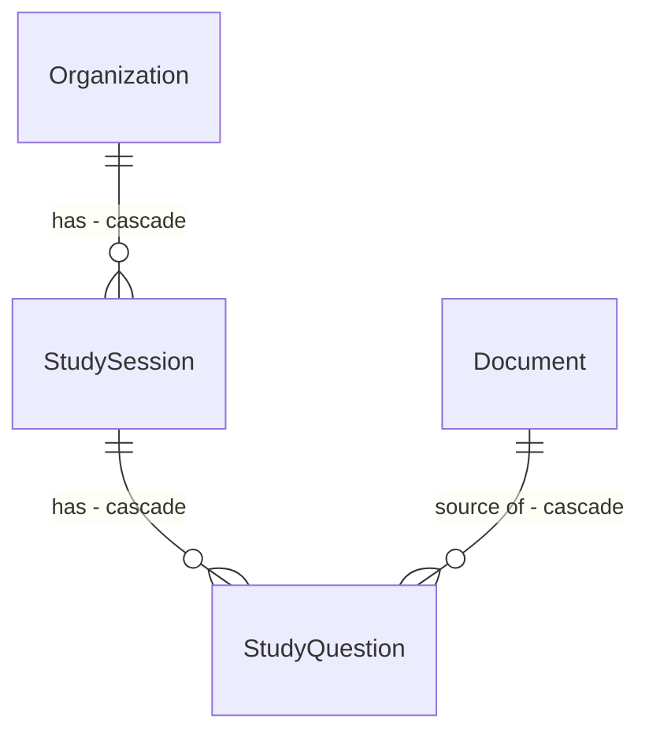

# Study Mode - perguntas geradas dos documentos, com a resposta certa ao lado do trecho

## Problem

Quem usa o produto para estudar (persona "Estudante" do PRD: "estudar a partir das próprias
apostilas") só consegue fazer perguntas à IA. O produto não pergunta nada de volta: para se testar, a
pessoa precisa inventar as próprias perguntas e conferir sozinha no documento se acertou. Não há
jeito de saber o que ela ainda não domina no material.

A fonte não traz números. A evidência é o pedido do usuário em 2026-09-24.

Depois desta mudança, na organização, o usuário escolhe os documentos e quantas perguntas quer. O
produto gera perguntas de múltipla escolha a partir de trechos desses documentos. Ao responder
errado, ele vê a alternativa certa, uma explicação curta e o trecho de onde a pergunta saiu, ao lado,
na mesma prévia do chat.

## Flow

Reusa a leitura de trechos da prévia (`GetDocumentChunks`, source-preview door 1) e o `SourcePreview`
do web para mostrar o trecho, o `IChatClient` padrão para gerar, e o filtro de dono por organização
(AD-010). Não reusa o `AskPipeline`: aqui não há pergunta do usuário para recuperar por similaridade,
os trechos são sorteados.

1. `POST /api/organizations/{id}/study-sessions` (door 2) -> `Features/Study/CreateStudySession` (new, no door - placement) resolve a organização, sorteia até N trechos distintos dos documentos escolhidos
2. uma chamada ao `IChatClient` (exists) com os trechos -> JSON com uma pergunta, 4 alternativas, a certa e uma explicação por trecho (door 3); descarta as inválidas
3. persiste `StudySession` + `StudyQuestion`s (door 1) e devolve as perguntas **sem** a alternativa certa e sem a fonte
4. `POST /api/study-sessions/{sessionId}/questions/{questionId}/answer` (door 2) -> `Features/Study/AnswerStudyQuestion` (new) corrige no servidor, grava a resposta, devolve se acertou, a certa, a explicação e a fonte (`documentId`, `chunkIndex`)
5. web: aba **Estudar** (new) mostra a pergunta; errou -> alternativa certa + explicação, e o `SourcePreview` (exists) abre o trecho à direita

## Impact

| Front | What changes |
| --- | --- |
| domain | termo novo: `StudySession` - uma rodada de estudo numa organização: os documentos escolhidos e as perguntas geradas |
| domain | termo novo: `StudyQuestion` - pergunta de múltipla escolha gerada de um trecho, com as 4 alternativas, a certa, a explicação e a resposta do usuário |
| domain | termo existente: `Document` passa a ser referenciado por perguntas de estudo. Apagar um documento apaga as perguntas geradas dele. Quem apaga documentos hoje: `DeleteDocument`, `DeleteOrganization` (cascata) |
| web | a organização ganha uma terceira aba: Conversa · Estudar · Base |
| custo | cada sessão faz 1 chamada ao modelo de chat com até 20 trechos (~20 mil caracteres). Conta no mesmo limite de 20 chamadas de IA por minuto do ask |
| stored data | tabelas novas; nada a migrar |

## Relations

Restrições de mão única: `StudyQuestion` guarda o documento de origem e o índice do trecho (não o id
do `Chunk`), a alternativa certa entre 0 e 3, e a resposta do usuário nula até responder; uma pergunta
é respondida uma vez só (door 1). A posse vem da organização da sessão (AD-010).

## Surface

Todo erro é problem details (AD-007). Toda rota exige sessão (`401`). Recurso de outro usuário responde `404`.

| Route | In | Out | Status |
| --- | --- | --- | --- |
| `POST /api/organizations/{id}/study-sessions` | `documentIds?` (ausente = todos), `questionCount` (5, 10 ou 20) | `id` · `createdAt` · `questions[{id, position, prompt, options[4]}]` | `201`, `400`, `401`, `404`, `422`, `429`, `502` |
| `POST /api/study-sessions/{sessionId}/questions/{questionId}/answer` | `option` (0 a 3) | `correct` · `chosenOption` · `correctOption` · `explanation` · `source{documentId, fileName, chunkIndex}` | `200`, `400`, `401`, `404`, `409` |

## Landing

| One-way door | Literal shape | Alternative rejected |
| --- | --- | --- |
| 1. Tabelas de estudo | `study_sessions (id, organization_id FK cascade, question_count, created_at)`; `study_questions (id, session_id FK cascade, position, document_id FK cascade, chunk_index, prompt, options text[] com exatamente 4 itens, correct_option smallint check 0..3, explanation, chosen_option smallint null check 0..3, answered_at null)`, índice único `(session_id, position)`. Filtro de dono: `s.Organization.OwnerId == CurrentUserId`, e `StudyQuestion` via `q.Session.Organization.OwnerId` | Perguntas só no cliente (sem tabela): a alternativa certa teria que ir para o navegador antes da resposta, e qualquer um veria o gabarito na aba de rede. FK para `chunks.id`: os trechos são recriados se o documento for reenviado, e a prévia já endereça por documento + índice |
| 2. Rotas | `POST /api/organizations/{id}/study-sessions` (no grupo de organizações) e `POST /api/study-sessions/{sessionId}/questions/{questionId}/answer` (grupo novo `/api/study-sessions`), ambas com `RequireRateLimiting` só na criação (`AskPipeline.RateLimitPolicy`) | Correção no cliente com o gabarito na resposta da criação: ver door 1. Uma rota de resposta por sessão inteira (enviar todas no fim): o usuário precisa ver a correção pergunta a pergunta |
| 3. Contrato com o modelo | uma chamada com os trechos numerados `[1]..[N]`; resposta JSON `{"questions": [{"chunk": <n>, "prompt": "...", "options": ["...", "...", "...", "..."], "correct": <0..3>, "explanation": "..."}]}`. O servidor aceita só itens com `chunk` válido e não repetido, 4 alternativas não vazias e diferentes entre si, `correct` em 0..3, `prompt` não vazio; embaralha as alternativas antes de gravar para a certa não ficar sempre na mesma posição | Uma chamada por trecho: 20 chamadas em série estouram o tempo de uma requisição síncrona (AD-008) e o limite por minuto. Pedir ao modelo só a pergunta e gerar as erradas no servidor: não há como gerar alternativas plausíveis sem o modelo |

- Nada mais nesta mudança é difícil de reverter: textos, prompt, layout da aba e quantidades permitidas são código trocável.

## Criteria

### S1: Gerar uma sessão de estudo (P1)

Escolher documentos e receber perguntas de múltipla escolha sobre eles.

**Acceptance Criteria**

1. WHEN `POST /api/organizations/{id}/study-sessions` recebe `questionCount` 5 com dois `documentIds` da organização THEN the system SHALL responder `201` com `id`, `createdAt` e até 5 `questions`, cada uma com `id`, `position` (1..n em ordem), `prompt` e exatamente 4 `options`
2. The system SHALL sortear os trechos só dos documentos pedidos (ou de todos os da organização quando `documentIds` não vem), sem repetir trecho na mesma sessão
3. WHEN a organização tem menos trechos que `questionCount` THEN the system SHALL gerar no máximo uma pergunta por trecho existente
4. The resposta de criação SHALL nunca conter a alternativa certa, a explicação nem a fonte da pergunta
5. IF `questionCount` não é 5, 10 ou 20, ou `documentIds` vem vazio THEN the system SHALL responder `400` com `errors.questionCount` ou `errors.documentIds`
6. IF a organização é de outro usuário ou inexistente, ou algum `documentId` não é da organização THEN the system SHALL responder `404` e não chamar o modelo
7. IF os documentos escolhidos não têm nenhum trecho THEN the system SHALL responder `422` e não chamar o modelo
8. WHEN o modelo devolve itens inválidos (trecho inexistente ou repetido, número de alternativas diferente de 4, alternativas vazias ou repetidas, `correct` fora de 0..3, `prompt` vazio) THEN the system SHALL descartar esses itens e gravar só os válidos
9. IF o modelo falha, não devolve JSON, ou nenhum item é válido THEN the system SHALL responder `502` sem gravar sessão
10. The system SHALL gravar as alternativas de cada pergunta numa ordem embaralhada, com `correct_option` apontando para a certa depois do embaralhamento
11. The system SHALL mandar ao modelo só os trechos dos documentos escolhidos daquela organização, e contar cada criação no limite de 20 chamadas por minuto do ask (`429` na 21ª)

**Independent test:** na Nexora, escolher `01_rh.txt`, pedir 5 perguntas e receber 5 perguntas com 4 alternativas, sem gabarito na resposta.

### S2: Responder e ver a correção (P1)

Saber na hora se acertou e, quando errou, qual era a certa e de onde ela vem.

**Acceptance Criteria**

12. WHEN `POST .../answer` recebe a alternativa certa THEN the system SHALL responder `200` com `correct = true`, `chosenOption`, `correctOption`, `explanation` e `source{documentId, fileName, chunkIndex}` do trecho de origem, e gravar a resposta
13. WHEN recebe uma alternativa errada THEN the system SHALL responder `200` com `correct = false`, a `chosenOption` enviada, a `correctOption` certa, a `explanation` e a `source`
14. IF a pergunta já foi respondida THEN the system SHALL responder `409` e manter a primeira resposta
15. IF `option` está fora de 0..3 THEN the system SHALL responder `400` com `errors.option`
16. IF a sessão é de outro usuário ou inexistente, ou a pergunta não é daquela sessão THEN the system SHALL responder `404`

**Independent test:** responder errado uma pergunta e receber a certa, a explicação e o trecho de origem.

### S3: Aba Estudar (P1)

A rodada de estudo inteira sem sair da organização.

**Acceptance Criteria**

17. The organização SHALL ter as abas Conversa · Estudar · Base; Estudar abre em `/organizations/{id}/study`
18. WHEN a aba Estudar abre THEN the system SHALL mostrar os documentos da organização com caixas marcadas (todos marcados por padrão), a escolha de 5, 10 ou 20 perguntas (padrão 10) e o botão "Começar"
19. WHEN a organização não tem documentos THEN the aba SHALL mostrar "Suba documentos na Base para estudar" com link para a Base, sem o botão "Começar"
20. WHILE as perguntas são geradas the aba SHALL mostrar "Gerando perguntas…" e desabilitar "Começar"
21. WHEN a sessão começa THEN the aba SHALL mostrar uma pergunta por vez com "Pergunta N de M", as 4 alternativas e o botão "Responder", desabilitado até escolher uma
22. WHEN a resposta está certa THEN the aba SHALL marcar a alternativa em verde, mostrar "Certo!" e a explicação, e oferecer "Ver no documento", que abre a prévia do trecho
23. WHEN a resposta está errada THEN the aba SHALL marcar a escolhida em vermelho e a certa em verde, mostrar "A resposta certa é: <texto da certa>" e a explicação, e abrir sozinha a prévia do trecho de origem à direita
24. WHEN o usuário clica em "Próxima pergunta" THEN the aba SHALL fechar a prévia e mostrar a pergunta seguinte
25. WHEN a última pergunta é respondida THEN the aba SHALL mostrar a correção dela como nas outras, com o botão "Ver resultado" no lugar de "Próxima pergunta"; clicar SHALL mostrar "Você acertou X de M" e o botão "Estudar de novo", que volta à escolha de documentos (confirmado pelo usuário em 2026-09-24)
26. IF a criação ou a resposta falha THEN the aba SHALL mostrar o `title` do problem details e manter a escolha feita

**Independent test:** estudar 5 perguntas da Nexora, errar uma de propósito e ver a certa com o trecho à direita.

## Out of scope

| Excluded | Why |
| --- | --- |
| Resposta aberta corrigida pela IA | escolha do usuário: múltipla escolha |
| Retomar uma sessão depois de recarregar a página, e histórico de sessões | a sessão fica gravada, mas listar e retomar é outra tela |
| Repetição espaçada (voltar nas que errou em outro dia) | precisa de histórico por pergunta ao longo do tempo |
| Estudar pela tela "Todas as IAs" | estudo é por organização, onde estão os documentos |
| Apagar sessões antigas (retenção) | sem requisito de retenção; somem com a organização ou o documento |

## Assumptions

| Assumption | Chosen default | Rationale | Confirmed? |
| --- | --- | --- | --- |
| Quantidades permitidas | 5, 10 ou 20; padrão 10 | cabe numa chamada ao modelo e numa requisição síncrona | n |
| Prévia quando acerta | não abre sozinha; botão "Ver no documento" | o pedido fala de mostrar o trecho quando erra | n |
| Idioma das perguntas | o mesmo do trecho | o material é do usuário | n |
| Uma pergunta por trecho | sim, sem repetir trecho na sessão | perguntas repetidas sobre o mesmo parágrafo cansam | n |
| Limite de custo | a criação conta no limite do ask (20/min) | é a chamada mais cara do produto | n |

**Open questions:** none - all resolved or logged above.

## Observable

| Surface | Decision | Landing |
| --- | --- | --- |
| screen `Estudar` - escolha | empty (sem documentos) | AC 19 |
| screen `Estudar` - escolha | loading | AC 20 |
| screen `Estudar` - escolha | error | AC 26 |
| screen `Estudar` - pergunta | estado inicial e ordem | AC 21 |
| screen `Estudar` - pergunta | certo, errado | AC 22, 23 |
| screen `Estudar` - pergunta | error | AC 26 |
| screen `Estudar` - fim | resultado e recomeço | AC 25 |
| screen `Estudar` | unauthorised | existing - `RequireAuth` |
| screen `Estudar` | destructive action | n/a - a aba não apaga nada |
| API `POST .../study-sessions` | error shape and codes | AC 5, 6, 7, 9 |
| API `POST .../study-sessions` | rate limit | AC 11 |
| API `POST .../answer` | error shape and codes | AC 14, 15, 16 |
| API `POST .../answer` | rate limit | n/a - sem chamada de IA, só leitura e uma escrita |
| all new routes | versioning | n/a - único consumidor é a SPA |

## Sources

- Conversa de 2026-09-24: "gerar perguntas para o usuário com base nos chunks e, quando o usuário responder errado, mostrar a resposta certa com o preview do doc ao lado"; respostas: múltipla escolha, documentos escolhidos pelo usuário
- [docs/PRD.md](../../../docs/PRD.md) - persona "Estudante"
