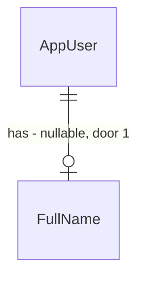

# Nome completo do usuário

## Problem

A conta guarda só e-mail e senha. Depois de entrar, nenhuma tela mostra quem está logado: a barra
lateral tem organizações, "Todas as IAs", "Lacunas" e "Sair", e o usuário não tem como confirmar em
qual conta está. Quem usa duas contas no mesmo navegador (ex.: a conta de desenvolvimento e uma
pessoal) só descobre em qual está pelo conteúdo das organizações. O pedido (usuário, 2026-09-24) não
traz outros números.

Depois desta mudança:
- O cadastro pede o nome completo junto com e-mail e senha, e o nome fica salvo na conta.
- Toda tela autenticada mostra, no topo, o nome de quem está logado.

## Flow

Reusa o `UserManager<AppUser>` do Identity para criar a conta (validação de senha e de e-mail
duplicado continuam as do Identity) e o login por cookie do `MapIdentityApi` sem mudança.

1. `RegisterPage`/`AuthForm` (exists) -> `POST /api/auth/register` com `fullName` (door 2) -> handler novo em `Features/Auth` valida o nome e chama `UserManager.CreateAsync`, persiste `AppUser.FullName` (door 1)
2. a SPA faz o login como hoje (`/api/auth/login?useCookies=true`, exists)
3. `useSession`/`RequireAuth` (exists) -> `GET /api/auth/me` (door 3) -> `{ email, fullName }`
4. out: `AppLayout` (exists) mostra `fullName` no topo da área de conteúdo, em toda tela autenticada

## Impact

| Front | What changes |
| --- | --- |
| domain | termo novo: `FullName` - nome completo informado no cadastro, vive em `AppUser` |
| contrato | `POST /api/auth/register` passa a exigir `fullName`. Consumidores: a SPA e os helpers de teste que registram (`ApiTestBase`, `AuthTests`, `RoutingChoiceTests`, `UnconfiguredAiTests`) |
| contrato | a sessão da SPA passa a vir de `GET /api/auth/me` em vez de `GET /api/auth/manage/info`; a rota do Identity continua existindo |
| stored data | coluna nova anulável em `AspNetUsers`. Contas que já existem ficam sem nome (sem backfill); a tela mostra o e-mail no lugar. A conta de desenvolvimento semeada ganha o nome `Administrador` |

## Relations

One-way constraints: nome anulável no banco (contas antigas), obrigatório para contas novas pela
validação do cadastro (door 2). No columns and no types here.

## Surface

Only routes this adds or whose signature changes.

| Route | In | Out | Status |
| --- | --- | --- | --- |
| `POST /api/auth/register` | `email`, `password`, `fullName` | vazio | `200`, `400` |
| `GET /api/auth/me` | cookie de sessão | `email` · `fullName` (null em conta antiga) | `200`, `401` |

## Landing

| One-way door | Literal shape | Alternative rejected |
| --- | --- | --- |
| 1. coluna do nome | `AppUser.FullName` `string?` com `HasMaxLength(100)`, migration `AddUserFullName`, sem backfill | `NOT NULL` com default `''`: toda conta antiga passaria a ter um nome vazio indistinguível de "não informado" |
| 2. cadastro próprio no mesmo caminho | `auth.MapPost("/register", ...).WithOrder(-1)` antes de `MapIdentityApi<AppUser>()`, com o mesmo formato de erro do Identity (`ValidationProblem` com o código do erro como chave, ex.: `DuplicateUserName`) | rota nova `/api/auth/signup`: o `/register` do Identity continuaria aberto e criaria contas sem nome |
| 3. leitura da sessão | `GET /api/auth/me` -> `{ email, fullName }`, `401` sem sessão | estender `manage/info`: é resposta fixa do Identity, não aceita campo novo |

- Nothing else in this change is hard to reverse

## Criteria

### S1: cadastro guarda o nome (P1)

Uma conta criada com nome devolve esse nome na sessão.

**Acceptance Criteria**

1. WHEN `POST /api/auth/register` recebe `email`, `password` válidos e `fullName` `"Maria da Silva"` THEN the system SHALL responder `200` e a conta SHALL ter `FullName` `"Maria da Silva"`
2. WHEN `fullName` chega com espaços nas pontas (`"  Maria da Silva  "`) THEN the system SHALL salvar `"Maria da Silva"`
3. IF `fullName` está ausente, vazio ou só com espaços THEN the system SHALL responder `400` problem details com `errors.fullName` e SHALL NOT criar a conta
4. IF `fullName` tem mais de 100 caracteres depois do trim THEN the system SHALL responder `400` problem details com `errors.fullName` e SHALL NOT criar a conta
5. IF o e-mail já existe THEN the system SHALL responder `400` problem details com `errors.DuplicateUserName` (o mesmo de hoje)
6. IF a senha não passa nas regras do Identity THEN the system SHALL responder `400` problem details com o código do Identity como chave (ex.: `PasswordTooShort`) e SHALL NOT criar a conta
7. WHEN a conta criada faz login com `?useCookies=true` THEN the system SHALL responder `200` (login do Identity sem mudança)
8. The system SHALL NOT escrever o nome completo em log

**Independent test:** registrar pela API com nome, logar e chamar `/api/auth/me`.

### S2: a sessão devolve quem está logado (P1)

**Acceptance Criteria**

9. WHEN um usuário logado chama `GET /api/auth/me` THEN the system SHALL responder `200` com `email` e `fullName` da própria conta
10. IF `GET /api/auth/me` é chamado sem sessão THEN the system SHALL responder `401`
11. WHEN a conta não tem nome (criada antes desta mudança) THEN `GET /api/auth/me` SHALL responder `fullName` `null`
12. WHEN a conta de desenvolvimento é semeada THEN the system SHALL gravar `FullName` `"Administrador"`

**Independent test:** `GET /api/auth/me` com e sem cookie.

### S3: o topo da tela mostra quem está logado (P1)

**Acceptance Criteria**

13. The register screen SHALL ter o campo obrigatório "Nome completo" antes de "E-mail", com `maxLength` 100
14. WHEN o cadastro é enviado THEN the web SHALL enviar `fullName` junto com `email` e `password`
15. IF o cadastro falha THEN the register screen SHALL mostrar o título do problem details e SHALL manter nome e e-mail preenchidos
16. WHILE o usuário está logado the app shell SHALL mostrar, numa barra no topo da área de conteúdo em toda tela autenticada, o `fullName` da sessão
17. IF a sessão tem `fullName` `null` THEN the app shell SHALL mostrar o `email` no lugar do nome
18. The login screen SHALL continuar só com e-mail e senha

**Independent test:** cadastrar pela tela e ver o nome no topo de `/organizations`.

## Out of scope

| Excluded | Why |
| --- | --- |
| editar o nome depois do cadastro | o pedido é guardar no cadastro e exibir; edição é um próximo passo |
| pedir o nome a contas antigas | mostram o e-mail; um aviso para completar o perfil é outra feature |
| avatar, iniciais, menu de conta no topo | o pedido é mostrar quem está logado; "Sair" continua na barra lateral |

## Assumptions

| Assumption | Chosen default | Rationale | Confirmed? |
| --- | --- | --- | --- |
| onde fica "o topo da tela" | barra fina no topo da coluna de conteúdo (à direita da barra lateral no desktop, abaixo dela no celular), nome alinhado à direita | a barra lateral não tem topo comum a todas as telas; a coluna de conteúdo tem | n |
| validação do nome | obrigatório, trim, 1 a 100 caracteres, qualquer caractere | nomes reais têm acentos, apóstrofos e hífens; não há regra de negócio além de existir | n |
| contas que já existem | sem backfill, `fullName` null, a tela mostra o e-mail | não há de onde tirar o nome; forçar agora é outra feature | n |

**Open questions:** none - all resolved or logged above.

## Observable

| Surface | Decision | Landing |
| --- | --- | --- |
| screen `RegisterPage` | error state | AC 15 |
| screen `RegisterPage` | loading state | existing - botão desabilitado com "Processando..." no `AuthForm` |
| screen `RegisterPage` | empty state | n/a - formulário, não lista |
| screen `RegisterPage` | unauthorised state | n/a - rota pública |
| screen `RegisterPage` | destructive action confirms | n/a - não há ação destrutiva |
| screen app shell (topo) | loading state | existing - `RequireAuth` mostra "Carregando..." até a sessão chegar, então o topo nunca renderiza sem sessão |
| screen app shell (topo) | empty state | AC 17 |
| screen app shell (topo) | error state | existing - `RequireAuth` mostra o título do erro da sessão |
| screen app shell (topo) | unauthorised state | existing - `RequireAuth` redireciona para `/login` no `401` |
| screen app shell (topo) | density and ordering | AC 16 |
| API `POST /api/auth/register` | error shape and codes | AC 3, 4, 5, 6 |
| API `GET /api/auth/me` | error shape and codes | AC 10 |
| API `GET /api/auth/me` | who may call it | AC 9, 10 |
| all new `/api/auth/*` | versioning, rate limits | n/a - só a SPA da mesma origem consome; o projeto não tem versionamento nem rate limit em nenhuma rota |

## Sources

- pedido do usuário, 2026-09-24: "when creating a user now we also need to save the complete name so we can show on the top of the screen who is the logged user"
